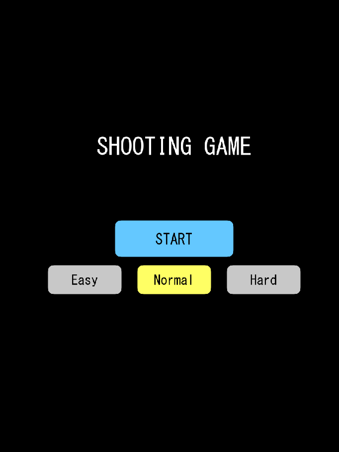

# team07
ソフトウェア工学Ⅱのための練習用リポジトリ
猪岡奏太
原田海輝
松村優里

シューティングゲーム
上から出現してくる敵機を撃ったり避けるゲーム
自機（戦闘機）
弾
敵機

シューティングゲーム取扱説明書
1.アプリの概要
このアプリは、敵の攻撃を避けつつ弾を発射して敵を倒す2Dシューティングゲームです。

2.操作方法
移動：矢印キー（← →）でプレイヤーを左右に移動できます。
攻撃：スペースキーを押すと弾を発射します。

3.ゲームの流れ
　1.タイトル画面で「スタート」を選ぶとゲームが始まります。
　2.敵が一定時間ごとに弾を撃ってきます。
　3.すべての敵を倒すとゲームクリアです。
　4.ゲームクリア時にはクリアタイムが表示されます[ゲーム画面](gamepage.png)

4.難易度設定
タイトル画面の「設定」ボタンから難易度（Easy / Normal / Hard）を選べます。
Easy：敵の移動速度・攻撃頻度が遅め。
Hard：敵の動きが速く、弾の間隔も短くなります。